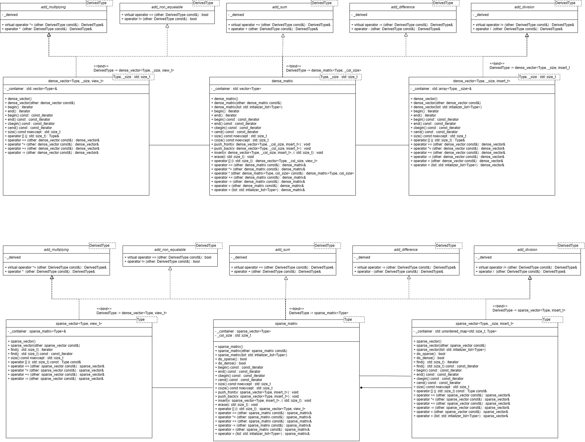

# Архитектура проекта
Все классы наследуются от классов-примесей (идиома C++ mixings), котороые реализуют базовые математические операции. 
Данная идеома реализуется с помощью идиомы crtp: классы примеси получают (в качестве параметра шаблона) тип производного класса, 
далее, используется static_cast<DerivedType*>(this) для получения доступа к данныи в производном классе.
## Плотные матрицы
Имеют фиксированное количество столбцов. Элементы матрицы можно получить оператором [i][j], где i - индекс строки, индекс столбца.
## Разряженные матрицы
Не имеют ограничений на размер. Благодаря хеш-таблицы, можно не хранить часть-повторяющиеся элементы. 
Доступ к элементам осуществляется также, как у плотной матрицы. Элементы возможно модифицировать только через итераторы, используя метод find(j), 
где j - индекс столбца.

